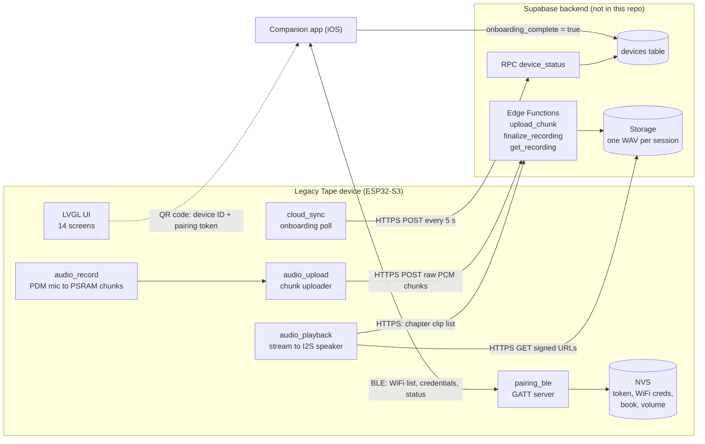
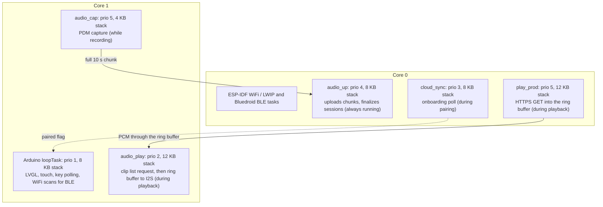
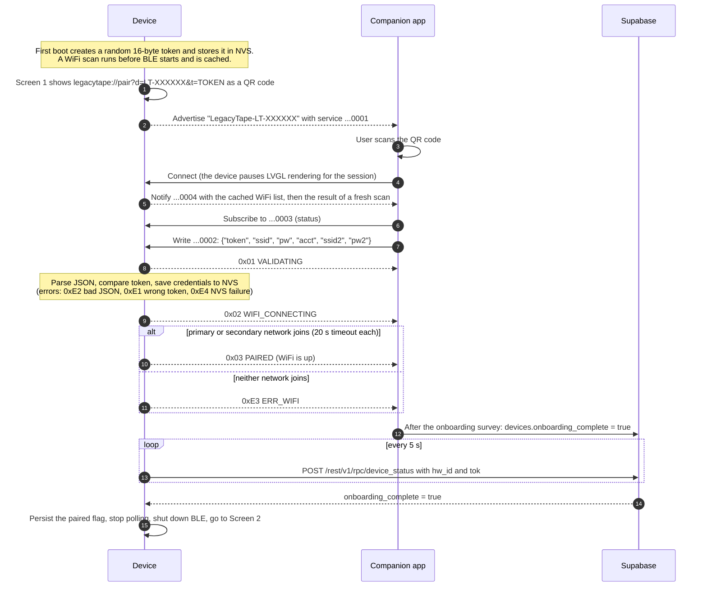
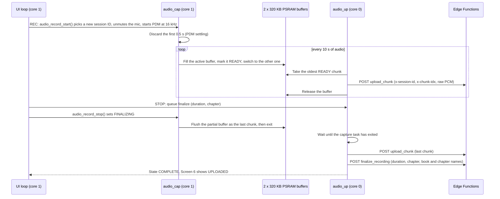

# Legacy Tape — device firmware

Legacy Tape is a cassette-recorder-style device that lets older adults record their life stories by pressing REC. I wrote this firmware for it. It runs on an ESP32-S3 touchscreen panel and does four things: it draws a tape-deck UI, records from the microphone, streams the audio to the cloud in 10-second chunks while the person is still talking, and plays finished chapters back through the speaker. Setup happens once from a [companion phone app](https://github.com/Bchiate/legacy-tape-app), which scans a QR code on the device and sends the WiFi credentials over Bluetooth LE.

<!--
  MEDIA PLACEHOLDER: add 1-2 device photos or a short GIF here.
  Put the files in docs/media/ and reference them, for example:

  <p align="center">
    
  </p>

  Optional build badge (replace OWNER):
  [](https://github.com/OWNER/legacy-tape-firmware/actions/workflows/build.yml)
-->

## At a glance

- **Hardware:** Elecrow CrowPanel Advance 5" HMI: ESP32-S3 (two cores at 240 MHz, 16 MB flash, 8 MB PSRAM), 800×480 RGB IPS panel, GT911 touch, plus five mechanical transport keys on an I2C expander.
- **Software:** Arduino-ESP32 3.0 (ESP-IDF 5.1, FreeRTOS), LVGL 8.3, LovyanGFX, ArduinoJson 7. Built with PlatformIO, with pinned versions and a GitHub Actions build.
- **UI:** 14 LVGL screens. Screens 1–3 started in SquareLine Studio, 4–14 are hand-written, and the cassette artwork has animated reels.
- **Recording:** PDM mic at 16 kHz / 16-bit mono into two 10-second PSRAM buffers. A task on the other core uploads each chunk over HTTPS while recording continues, then asks the server to finalize the session.
- **Playback:** the backend returns a chapter's takes as signed URLs. They are streamed through a PSRAM ring buffer to I2S, so memory use stays fixed however long the chapter is.
- **Provisioning:** QR code plus a BLE GATT service. WiFi credentials and a 128-bit pairing token are kept in NVS.

## How it works

### System architecture



The device never talks to the app over the internet. The app hands over WiFi credentials over BLE and then writes `onboarding_complete` to the backend. The device notices by polling, which takes it from the pairing screen to the setup screens. Calls to the backend identify the device with its ID and pairing token: as `x-hardware-id` / `x-pair-token` headers on the Edge Function calls, and as the `hw_id` / `tok` parameters of the RPC. The audio itself is downloaded from signed Storage URLs.

### Screens

| # | Screen | Reached from |
|---|---|---|
| 1 | Pairing (live QR code) | boot, while unpaired |
| 2 | Setup complete | backend reports onboarding complete |
| 3 | Name your book (keyboard) | Screen 2, or NEW BOOK on Screen 8 |
| 4 | Ready (home) | boot once paired, and most "close" buttons |
| 5 | Recording (spinning reels, live level bar) | REC |
| 6 | Stopped (upload progress: UPLOADING / UPLOADED / NOT SENT) | STOP while recording |
| 7 | Playback (position, volume) | PLAY |
| 8 | Book picker | BOOK |
| 9 | AI prompt (design mock-up) | dev-mode navigator only |
| 10 | Chapter picker (add / select chapters) | CHAPTER |
| 11 | Volume overlay for a future rotary encoder (mock-up) | dev-mode navigator only |
| 12 | Offline error (mock-up) | dev-mode navigator only |
| 13 | Chapter advanced (mock-up) | dev-mode navigator only |
| 14 | Settings (static placeholder values) | SETTINGS |

### FreeRTOS tasks and cores



Network I/O runs on core 0, next to the WiFi, LWIP and Bluedroid tasks, which Arduino-ESP32 3.0 pins to core 0 in its sdkconfig. The one exception is the short `get_recording` request that the playback task makes before streaming starts. Core 1 is left to the UI loop and the two audio tasks that have to keep real-time pace with the I2S hardware. The tasks hand work to each other through buffer states and flags. Screen changes always happen in `loop()`, so LVGL is only ever called from one task.

### Pairing over BLE



GATT service `1ec0de7a-7e2d-4f4f-9c1d-1ec0de7a0001`. Characteristics share the same prefix.

| Characteristic | Properties | Content |
|---|---|---|
| `...0002` | write | Credentials JSON. `token`, `ssid` and `acct` are required. `ssid2`/`pw2` add a fallback network. Must be 1–480 bytes. |
| `...0003` | read, notify | One status byte (table below) |
| `...0004` | read, notify | JSON array of `{"ssid", "rssi"}`, strongest first, trimmed to fit a single 512-byte ATT value |

| Status | Name | Meaning |
|---|---|---|
| `0x00` | IDLE | Initial value |
| `0x01` | VALIDATING | Payload received, being checked |
| `0x02` | WIFI_CONNECTING | Credentials saved, joining WiFi |
| `0x03` | PAIRED | WiFi connected. The app still finishes onboarding before the device leaves Screen 1. |
| `0xE1` | ERR_TOKEN | Token does not match the one in the QR code |
| `0xE2` | ERR_JSON | Empty or oversized payload, invalid JSON, or a required field missing |
| `0xE3` | ERR_WIFI | Neither network could be joined |
| `0xE4` | ERR_INTERNAL | Writing the credentials to NVS failed |

### Recording: capture, chunk, upload, finalize



If WiFi drops, the uploader reconnects with the stored credentials (primary, then secondary) and the chunks stay queued. After 15 consecutive failures during a recording it stops the capture and records the reason. A finalize request is retried every 3 s until the server accepts it. A session where nothing was uploaded is never finalized and shows NOT SENT. The backend joins the chunks into one WAV per session.

## Engineering notes

The problems below each showed up on the hardware. The code comments next to each fix explain them in more detail.

### One I2C bus for touch, keys and the panel controller

Code: `legacytape_arduino.ino` (`buttons_poll()`, `backlight_init()`), `audio_record.cpp` (`unmute_mic()`)

The GT911 touch controller, the MCP23017 key expander and the panel's STC8H1K28 backlight/audio controller share one 400 kHz bus on GPIO 15/16. The main loop runs about once per millisecond. Polling the expander on every pass came to about 1,000 transactions a second, all of them NACKing when the key board was unplugged, and that starved the touch reads until the screen felt dead. Key polling is now limited to 50 Hz with a 20 ms debounce. The expander is probed once at boot, and if it does not answer, polling is switched off. The panel controller at 0x30 needs a wake-up handshake at boot: the firmware sends the wake command and pulses the GT911 reset strap until both chips ACK. That controller also owns the mic mute, and the unmute command can blank the backlight. So the mic is unmuted only when a recording starts, and the backlight-on command is sent straight after it.

### Keeping TLS off the UI core

Code: `audio_upload.cpp` (`audio_upload_begin()`), `cloud_sync.cpp` (`cloud_sync_begin()`), `audio_playback.cpp`

Each request is a blocking HTTPS call, and the TLS handshake alone takes one to two seconds. Running them on the UI core, or from `loop()` itself, froze LVGL: the level meter stopped mid-recording and taps on the pairing screen were dropped. The uploader, the onboarding poller and the playback downloader are now separate tasks pinned to core 0. Their stacks are sized for mbedTLS: 8 KB for the uploader and poller, and 12 KB for the playback producer, which makes one TLS GET per clip (8 KB risked overflowing).

### Short recordings

Code: `audio_upload.cpp` (`upload_task()`), `audio_record.cpp` (`audio_record_capture_active()`)

A take shorter than one chunk has only a final partial chunk, and that chunk is flushed when the capture task exits. The uploader used to decide "nothing was uploaded" before that flush happened. It now waits for `audio_record_capture_active()` to go false before judging the session.

### Streaming playback

Code: `audio_playback.cpp`

A producer task downloads each clip, skips the 44-byte WAV header and writes PCM into a 320 KB ring buffer. The ring is created with `xRingbufferCreateStatic` so its storage can live in PSRAM while the control block stays in internal RAM. A consumer task waits for about 3 s of audio (96 KB) and then drains the ring into I2S. The blocking `i2s.write()` sets the pace, and a full ring blocks the producer, which provides backpressure. Each of these details fixed a real bug:
- The producer yields on every iteration so the core-0 idle task can feed the task watchdog.
- Odd-length network reads are re-aligned with a one-byte carry, so samples never get byte-swapped into noise.
- The consumer's read size is capped to fit the mono-to-stereo expansion buffer. An earlier 2x overflow caused crackling and crashes.
- Audio goes out on the right channel only, because the panel's amplifier path sums left and right and duplicated samples clipped hard.
- About 120 ms of silence is written before I2S is torn down, which avoids a pop.

`audio_playback_stop()` is non-blocking. Blocking inside an LVGL event handler froze the screen, so it now sets a flag and the tasks shut themselves down.

### PSRAM

Code: `legacytape_arduino.ino` (`setup()`), `audio_record.cpp` (`audio_record_begin()`), `audio_playback.cpp` (`SpiRamAllocator`)

The large buffers live in the 8 MB PSRAM: two full-frame LVGL buffers (2 × 750 KB), the two recording buffers (2 × 320 KB), the playback ring (320 KB) and the clip list. That leaves internal RAM for WiFi, BLE and TLS. After BLE, WiFi and audio had fragmented the internal heap, `deserializeJson` started failing on small, valid responses. A custom `ArduinoJson::Allocator` that allocates from PSRAM (`SpiRamAllocator`) fixed it.

### An RGB panel with full-frame refresh

Code: `legacytape_arduino.ino` (`setup()`, `loop()`), `ui_widgets.c`, `ui_helpers.c` (`_ui_screen_change()`), `pairing_ble.cpp` (`pairing_ble_is_busy()`)

The panel scans out continuously from PSRAM. LVGL renders into two full-frame buffers with `full_refresh = 1`, which avoids tearing, but every redraw then repaints all 384,000 pixels. Three things follow from that. The pilot lamp no longer pulses, because the animation kept repainting hidden screens about 30 times a second. The Recording and Playback timers and the reel animations skip work while their screen is hidden. Screen changes are hard cuts. WiFi also keeps buffers in PSRAM, and redrawing while WiFi connected caused visible jitter, so the loop stops calling `lv_timer_handler()` for the length of a BLE pairing session. That pause clears itself after 90 s, so a missed disconnect cannot freeze the UI for good.

### BLE and WiFi on one radio

Code: `pairing_ble.cpp` (`scan_and_cache()`, `pairing_ble_loop()`)

BLE and WiFi share the ESP32-S3's single 2.4 GHz radio. With a phone connected over BLE, asynchronous WiFi scans often never completed, and the app's network picker stayed empty. The device now scans once at boot, before BLE starts, and caches the result. On each BLE connect it serves the cache immediately. It then runs a synchronous scan from the main loop rather than the BLE callback task, and publishes the result only if networks were found. Scanning stops once credentials arrive, because a scan would disconnect the station that is being brought up.

### Flash budget

Code: `partitions.csv`

The stock partition schemes cap the app at 3 MB, so the table trades OTA for a single 5 MiB app slot. The production image is 4.55 MiB (91% of that slot). The linker map breaks it down like this:

| Component | Size |
|---|---|
| Four uncompressed RGB565+alpha bitmaps | 2.58 MiB |
| Bluetooth (Bluedroid host and controller) | 0.55 MiB |
| WiFi, LWIP and coexistence | 0.44 MiB |
| ESP-IDF and Arduino core (everything else) | 0.44 MiB |
| TLS and HTTP client | 0.19 MiB |
| LVGL, LovyanGFX, fonts and all application code | 0.34 MiB |

The largest bitmap (1.07 MiB) is the static QR-card artwork on Screen 1. It is always hidden at runtime because the QR code is drawn live, so removing it, or moving images to the unused 10.9 MB SPIFFS partition, is the cheapest way to win space back.

## Hardware

Everything except the transport keys and the loudspeaker is on the CrowPanel board. Pins are taken from the code (`LovyanGFX_Driver.h`, `audio_record.cpp`, `audio_playback.cpp`, `legacytape_arduino.ino`).

| Part | Connection | Notes |
|---|---|---|
| Elecrow CrowPanel Advance 5" HMI | ESP32-S3-WROOM-1-N16R8 | 16 MB QIO flash, 8 MB OPI PSRAM |
| 800×480 IPS panel | 16-bit RGB parallel, 21 MHz pixel clock (LovyanGFX `Bus_RGB` / `Panel_RGB`) | Two full-frame buffers in PSRAM |
| GT911 touch | I2C `0x5D`, SDA 15 / SCL 16, 400 kHz | GPIO 1 reset strap selects `0x5D` |
| Backlight / audio controller | I2C `0x30` (STC8H1K28, V1.1/V1.2 panels) or TCA9534 at `0x18` (V1.0) | Both are driven at boot. The one that is fitted ACKs. |
| Microphone | PDM: CLK GPIO 19, DATA GPIO 20 | 16 kHz, 16-bit, mono. Unmuted through `0x30`. |
| Speaker | I2S: BCLK 5, LRC 6, DOUT 4, to the panel's amplifier (SPK port) | 16 kHz, right channel only |
| Transport keys | MCP23017 at I2C `0x20`, GPA0–GPA4 = REC, PLAY, RWD, FF, STOP | 5-key mechanical interlock switch, active-low with internal pull-ups. Optional, because the same actions are on screen. |

## Building and flashing

### Pinned toolchain

| Component | Version |
|---|---|
| PlatformIO platform | [pioarduino](https://github.com/pioarduino/platform-espressif32) `51.03.07` |
| Arduino-ESP32 core | 3.0.7 (ESP-IDF 5.1, GCC 12.2) |
| LVGL | 8.3.11, configured by [`include/lv_conf.h`](include/lv_conf.h) |
| LovyanGFX | 1.2.32 |
| ArduinoJson | 7.4.3 |
| PlatformIO Core (CI) | 6.2.0 |

These versions are pinned in [`platformio.ini`](platformio.ini) and built by [CI](.github/workflows/build.yml) for both the production and the dev-mode configuration. The 3.0 core line is the one the firmware was developed on. The sources also compile on Arduino-ESP32 3.3.12.

### Configuration

The backend URL and key are not committed. Copy the template and fill it in:

```sh
cp legacytape_arduino/config.example.h legacytape_arduino/config.h
```

`config.h` defines `LT_SUPABASE_URL` and `LT_SUPABASE_PUBLISHABLE_KEY`, and it is gitignored. The endpoint paths live in [`backend_config.h`](legacytape_arduino/backend_config.h), the only file that includes `config.h`. If `config.h` is missing, the build stops with an `#error` that says what to do. CI builds with the placeholder values from the template.

### PlatformIO

```sh
pip install platformio
pio run                          # build the production firmware
pio run -t upload -t monitor     # flash, then open the serial monitor (115200 baud)
```

If the upload port does not show up, hold BOOT, tap RESET, release BOOT and upload again.

### Dev mode

`LT_DEV_MODE=1` builds a UI-only firmware. It skips pairing, BLE and WiFi, never starts the mic, uploads or playback, and puts a ‹ › navigator on LVGL's top layer for stepping through all 14 screens. It is useful for styling work without the companion app.

```sh
pio run -e crowpanel-dev -t upload
```

The default is `0`, set in `legacytape_arduino.ino` behind an `#ifndef`, so it can also be set with `-DLT_DEV_MODE=1` from any build system.

### Arduino IDE

CI does not test this path, but it uses the same versions.

1. Boards Manager: **esp32 by Espressif Systems 3.0.7**. Library Manager: **lvgl 8.3.11**, **LovyanGFX 1.2.32**, **ArduinoJson 7.4.3**.
2. Copy `include/lv_conf.h` into your sketchbook's `libraries/` folder, next to `lvgl/`.
3. Create `legacytape_arduino/config.h` as described above, then open `legacytape_arduino/legacytape_arduino.ino`.
4. Tools menu: Board **ESP32S3 Dev Module**, USB CDC On Boot **Enabled**, Flash Size **16MB**, PSRAM **OPI PSRAM**, Partition Scheme **Custom**. With Custom, the IDE uses `partitions.csv` from the sketch folder. The 4.55 MiB image does not fit the stock 3 MB schemes.

## Project layout

```
.
├── platformio.ini               build configuration with pinned versions
├── include/lv_conf.h            LVGL configuration
├── legacytape_arduino/          Arduino sketch (folder name must match the .ino)
│   ├── legacytape_arduino.ino   boot sequence, display/touch glue, transport keys, main loop
│   ├── pairing.*                device ID, pairing token, stored credentials (NVS)
│   ├── pairing_ble.*            BLE GATT provisioning service
│   ├── cloud_sync.*             onboarding-complete poll
│   ├── audio_record.*           PDM capture into PSRAM chunk buffers
│   ├── audio_upload.*           chunk upload and finalize task
│   ├── audio_playback.*         streaming playback (producer, ring buffer, consumer)
│   ├── book.*                   book name and chapter list (NVS)
│   ├── backend_config.h         endpoint paths, config.h guard
│   ├── config.example.h         template for the gitignored config.h
│   ├── LovyanGFX_Driver.h       RGB panel and GT911 setup (from Elecrow's example code)
│   ├── partitions.csv           flash layout
│   ├── ui.*, ui_Screen*.*       LVGL screens
│   ├── ui_widgets.*             shared widgets (top bar, cassette, transport row, pickers)
│   └── ui_img_*.c, ui_font_*.c  generated image and font data
├── tools/gen_cassette.py        regenerates the cassette artwork arrays (source PNG not included)
├── docs/media/                  photos and GIFs for this README
└── .github/workflows/build.yml  CI build
```

## Security notes and known limitations

This is prototype firmware. These are the gaps I know about and how I plan to close them.

### Security

- **TLS does not validate certificates.** All five HTTPS clients (`audio_upload.cpp` ×2, `audio_playback.cpp` ×2, `cloud_sync.cpp`) call `WiFiClientSecure::setInsecure()`. Traffic is encrypted, but the server is not authenticated, so someone on the network could impersonate the backend. Plan: pin the root CAs for the API and storage hosts with `setCACert()`, or attach the ESP-IDF certificate bundle.
- **BLE provisioning has no link-layer security.** The GATT service does not use pairing, bonding or encryption. Any nearby central can connect, and the WiFi password crosses the air in clear text. The token check (the token is only displayed in the QR code) stops a stranger from provisioning the device, but it does not stop passive sniffing. Plan: require LE Secure Connections with a passkey shown on screen before the credentials characteristic accepts writes, or encrypt the payload with a key derived from the QR token (for example AES-GCM with an HKDF of the token), so only the phone that scanned the code can read it.
- **Secrets at rest.** The token and WiFi credentials are stored in plain NVS, so anyone with USB access can dump them from flash. Plan: enable flash and NVS encryption on production units.
- **Backend key.** The Supabase publishable key is a client-side key that ships in every device, so authorization has to happen on the backend (RLS and the hardware ID / pairing token checks). It is kept out of the repository so each deployment uses its own project.

### Known limitations

- **Blocking WiFi connect at boot.** On a paired device, `setup()` waits up to 8 s for the primary network and 8 s for the secondary before the first frame is drawn. Plan: event-driven reconnect (`WiFi.onEvent`) with an on-screen offline state.
- **A failed chunk upload is dropped.** If a POST fails while WiFi is up, the buffer is released so capture can continue, and the session has a gap. With WiFi down, chunks wait, but after about 10 s offline both buffers are full and capture stalls. After 15 consecutive failures the recording stops, its remaining chunks are discarded, and the Recording screen does not say why yet. Plan: spill chunks to the unused SPIFFS partition, retry with backoff, and show the error.
- **RWD and FF do nothing yet.** Playback is sequential. Seeking needs HTTP Range requests on the signed URLs.
- **Mock-up screens.** Screens 9, 11, 12 and 13 are design mock-ups reachable only from the dev-mode navigator. Settings (Screen 14) shows static values. NEW BOOK renames the single book.
- **No OTA.** The partition table has a single app slot.
- **PLAY resumes, it does not switch.** If Playback was left without STOP and PLAY is pressed again, the chapter that is already streaming keeps playing, even if another chapter was selected in between.

### Changed since the last hardware test

These changes compile in both build configurations, but have not been run on the device yet:

- Screens are built once and cached, so recording and playback used to start only on the first visit after boot. They now start from `LV_EVENT_SCREEN_LOADED` handlers on every visit (`ui_Screen5.c`, `ui_Screen7.c`). Coming back to Recording mid-take keeps the take running. If the previous take is still uploading, REC shows its upload progress on Screen 6 instead of starting over. Chunks left over from a take aborted by network failures are discarded, so a new take never resets a buffer the uploader still holds.
- The Ready, Stopped, Book and Chapter screens refresh their book and chapter information on every visit, and the chapter list updates right after ADD.
- The hardware STOP key calls the same routines as the on-screen STOP buttons: it finalizes and stops a recording, or stops playback and returns to Ready.
- The pairing token is generated with the internal entropy source enabled (`bootloader_random_enable()`), and the boot log masks it.

## Credits

The panel bring-up (`LovyanGFX_Driver.h`, the backlight and touch power-up sequence) follows Elecrow's CrowPanel example code. The UI fonts are bitmap conversions of Archivo Black (SIL Open Font License 1.1). Screens 1–3 were laid out in SquareLine Studio.
